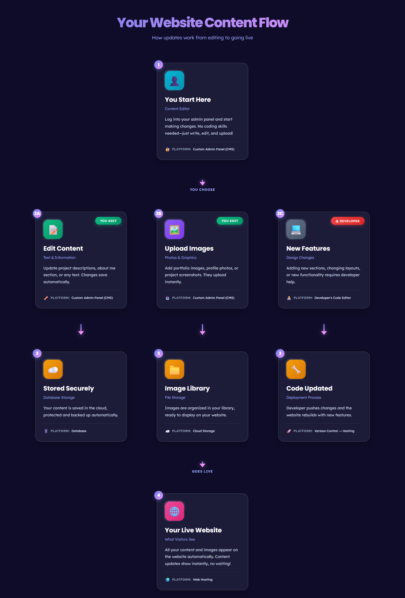

# Customer Content Flow Guide

## 📄 About This Document

A visual guide created by developers to help customers understand how content management works on their website. This document explains the flow from editing content to publishing it live.

**Purpose:** Customer onboarding and content management education
**Target Audience:** Non-technical clients who need to manage their website content
**Use Case:** Share with customers to help them understand what they can edit themselves vs. what requires developer assistance

## 🎯 What This Guide Shows

This interactive flowchart breaks down content management into clear, easy-to-understand steps:

**Step 1: You Start Here**
Customer logs into their admin panel

**Step 2: Three Paths to Choose From**
- **2A: Edit Content** - Update text and information (Customer can do)
- **2B: Upload Images** - Add photos and graphics (Customer can do)
- **2C: New Features** - Design or layout changes (Developer needed)

**Step 3: Automatic Processing**
Content is stored securely in the database or cloud storage

**Step 4: Your Live Website**
Changes appear automatically on the public website

## 🚀 How to Share This With Customers

### Option 1: Send the HTML File
Email or share `customer-content-flow.html` - customers can open it in any web browser.

### Option 2: Host on Your Website
Add this page to your client portal or documentation site.

### Option 3: Use for Onboarding
Walk through this guide during customer onboarding calls to explain their content management workflow.

## 🎨 Design Features

**Visual Design:**
- Dark gradient background for modern, professional look
- Color-coded paths for easy understanding
- Badge system: "You Edit" (green) vs. "Developer" (red)
- Emoji icons for visual recognition
- Mobile-friendly with horizontal scroll on small screens

**Customer-Friendly Language:**
- No technical jargon
- Clear action words
- Simple explanations
- Focus on "what you can do" vs. "what needs a developer"

## 📱 Mobile Responsiveness

The guide includes:
- CSS Scroll Snap for smooth horizontal scrolling on mobile
- Responsive typography using `clamp()`
- Touch-friendly interface
- Hidden scrollbars for clean appearance

## 🛠️ Technical Details

**Built With:**
- HTML5 - Structure
- CSS3 - Modern design with gradients, flexbox, and scroll snap
- Google Fonts - Poppins (headings) and Lexend (body text)
- No JavaScript - Maximum compatibility and simplicity

**Files:**
- `customer-content-flow.html` - Main guide
- `customer-content-flow.css` - External stylesheet

## 🔒 Privacy Note

Platform names are intentionally generic (e.g., "Database" instead of specific tech stack) to keep technical implementation details private while still educating customers.

## 💡 Customization Tips

**Update for Your Tech Stack:**
While platform names are generic by default, you can customize them in the HTML file if you want to be specific with certain clients.

**Change Color Scheme:**
Modify the CSS variables in `:root` to match your brand colors.

**Add Your Branding:**
Update the header text or add your logo to personalize for each client.

## 📧 Using This Guide

**Best Practices:**
1. Send to customers after project handoff
2. Reference during training sessions
3. Include in your documentation portal
4. Update customer contact info or support details as needed

**What to Tell Customers:**
- "This guide shows you what you can edit yourself"
- "Green badges mean you can do it instantly"
- "Red badges mean contact me for help"
- "Your content is always backed up automatically"

---

**Document Type:** Customer Education Guide
**Created:** January 2026
**Format:** HTML5 + CSS3
**License:** For developer use with clients
